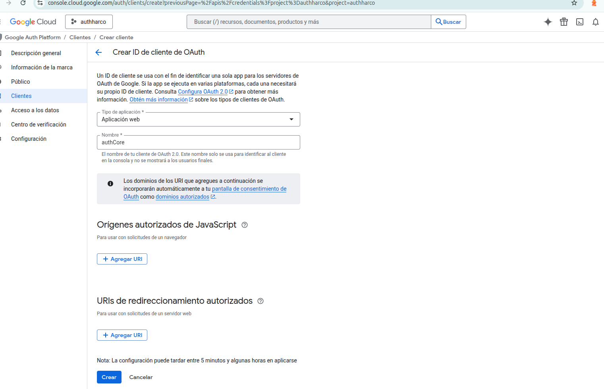

# Paso 1: Configurar la consola de Google
Para que Google te reconozca, necesitas un Client ID.

Ve a Google Cloud Console.

Crea un proyecto nuevo (ej. AuthCore-SaaS).

Busca "APIs & Services" > "Credentials".

Haz clic en "Create Credentials" > "OAuth client ID".

Configura la pantalla de consentimiento (consent screen) como "External".

En "Authorized JavaScript origins", añade http://localhost:3000.

Copia el Client ID que te darán. Guárdalo en tu .env.local como NEXT_PUBLIC_GOOGLE_CLIENT_ID.



¡Excelente! Ya estás en el corazón de la configuración de Google Cloud. Estás configurando tu Client ID, que es básicamente la "cédula de identidad" de tu aplicación SaaS ante Google.

Pasos en la Pantalla de Google (Imagen image_bec14a.png)
Para que el login funcione desde tu entorno de desarrollo local, debes completar esos campos así:

Orígenes autorizados de JavaScript: Haz clic en + Agregar URI y escribe: http://localhost:3000. Esto le dice a Google que confíe en las peticiones que vienen de tu Next.js local.

URIs de redireccionamiento autorizados: Por ahora, como estamos usando el flujo de botón (Identity Services), puedes dejarlo vacío o añadir también http://localhost:3000.

Crear: Dale al botón azul. Te aparecerá una ventana con tu ID de cliente y Secreto de cliente. Solo necesitamos el ID de cliente.

¡Excelente pregunta! Como junior, este es el momento donde muchos se traban, pero es clave para tu arquitectura SaaS Modular. La respuesta corta es SÍ, debes actualizar la consola de Google, porque Google solo confía en los dominios que tú le digas explícitamente.Aquí te explico el "por qué" y qué pasos exactos debes seguir cuando llegue el momento del despliegue:
____
## 1. ¿Qué cambiar en la Consola de Google?

Google usa una "lista blanca" de seguridad. Si intentas loguearte desde tusaas.vercel.app y no está en esa lista, Google bloqueará la petición por seguridad.

Cuando despliegues, tendrás que volver a la pantalla de tu imagen y añadir:

- Orígenes autorizados de JavaScript:
    - https://tu-app.vercel.app (La URL que te dé Vercel).
    - https://tu-dominio-final.com (Si luego compras uno).

- URIs de redireccionamiento autorizados:
    - Aunque uses el botón de Identity Services, es buena práctica añadir también la URL de Vercel aquí
    
    Nota de Seguridad: Asegúrate de que las URLs de producción usen https, Google no permite http fuera de localhost.
______________
## 2. ¿Qué cambiar en el código (Variables de Entorno)?

En Next.js, gracias a tu configuración de API_CONFIG y el uso de .env, el cambio será muy sencillo. No tocas el código, solo las variables en el panel de Vercel:

## 🌐 Configuración de Variables de Entorno

Para que el frontend se comunique correctamente con el backend y los servicios de autenticación, utilizamos las siguientes variables según el entorno:

| Variable | Valor Local (Development) | Valor Producción (Vercel) |
| :--- | :--- | :--- |
| **NEXT_PUBLIC_API_URL** | `http://localhost:8000` | `https://tu-backend.onrender.com` |
| **NEXT_PUBLIC_GOOGLE_CLIENT_ID** | `tu-id-local.apps.googleusercontent.com` | `tu-id-produccion.apps.googleusercontent.com` |

> **Nota:** Las variables con el prefijo `NEXT_PUBLIC_` son accesibles desde el navegador. No incluyas secretos sensibles (como llaves privadas de bases de datos) con este prefijo.
________
3. El Backend (Render) y CORS

Este es el punto más importante para tu Seguridad por Defecto. En tu backend Python (FastAPI/Django), tienes una lista de CORS.

- Hoy: Tu backend solo deja pasar a localhost:3000.
- Mañana (Render): Deberás actualizar el código de Python para que acepte peticiones desde la URL de Vercel.

```Python
# En tu backend (ej. main.py)
origins = [
    "http://localhost:3000",
    "https://tu-app-frontend.vercel.app", # <-- Debes añadir esto
]
```

Resumen para tu tranquilidad:No tienes que "reescribir" el programa. Tu estructura actual está bien diseñada para que solo cambies las URLs de configuración en los paneles de Google, Vercel y Render. El motor (el código que hemos escrito hoy) seguirá funcionando igual.